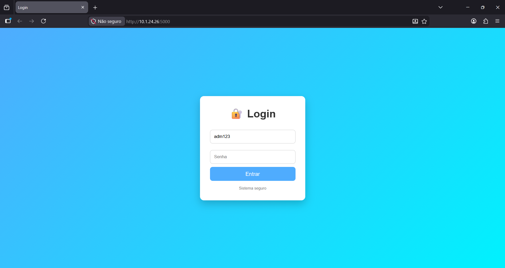
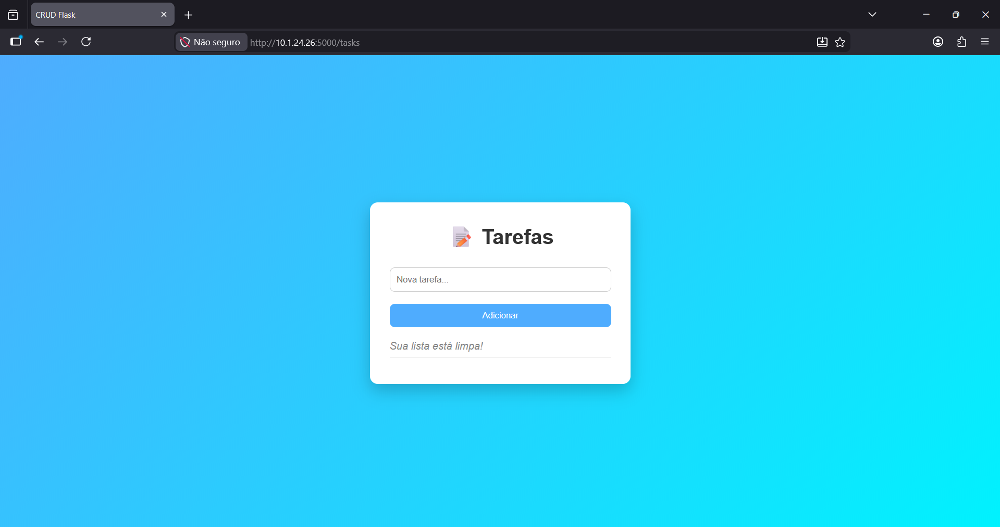
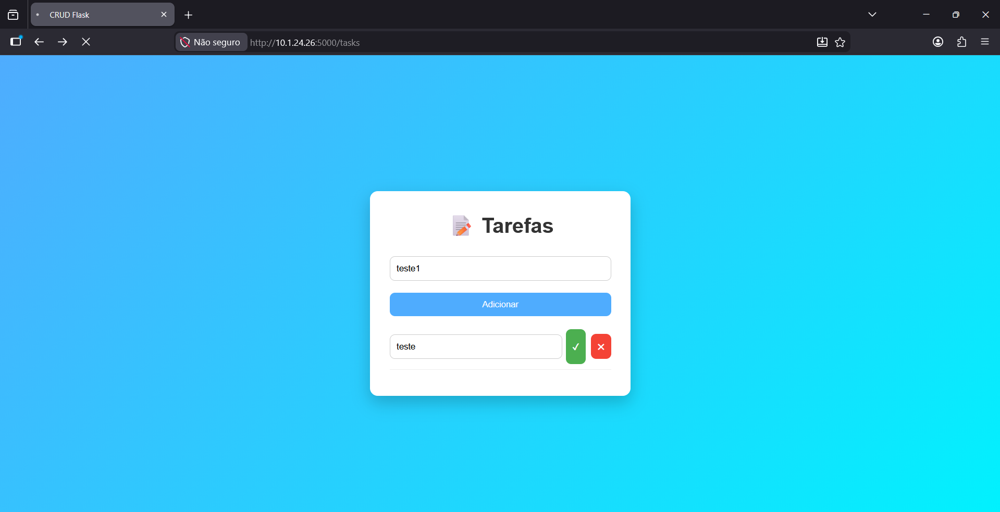
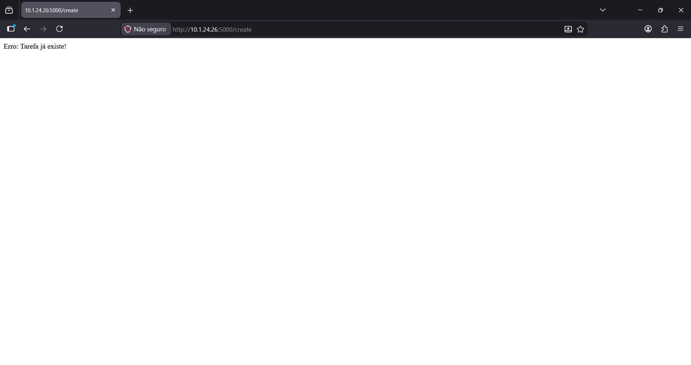

# API Flask - Camadas e Autenticação

Este repositório contém a entrega da atividade de uma aplicação Flask, aplicando boas práticas de Engenharia de Software.

## 👥 Equipe (Autores)
1. Mateus Lora - 1136218
2. Ricardo Rigo Antunes - 1136661
3. Gabriel Hanel - 1135926

## 🏗️ Arquitetura e Domínio do Código
Para melhorar a manutenibilidade, o código foi dividido em 4 responsabilidades:
* **`app.py` (Controlador):** Lida com as rotas HTTP (REST) e JSON, além de persistir os dados usando SQLAlchemy.
* **`services.py` (Regra de Negócio):** Valida os dados e formata a saída.
* **`database.py` (Camada de Dados):** Isola o banco de dados (SQLite) usando o padrão Repository.
* **`auth.py` (Autenticação):** Implementa um Decorator para proteger as rotas com API Key.

## 🔒 Como testar (Funcionalidade)
### Instalações necessárias:
`pip install flask`

`pip install sqlalchemy`

`pip install flask-sqlalchemy`

## Demonstração do projeto funcionando:
* Login:

* Colocar Tarefa:

* Tarefa Salva:

* Tarefa Existente: 

